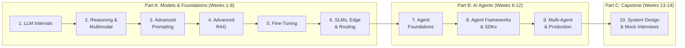

# 🎯 GenAI & AI Agents — Interview Preparation Roadmap

A structured, module-based preparation plan that interleaves **concept learning** with **hands-on project building**. Designed for an ML engineer who already knows prompting techniques and basic RAG.

> [!NOTE]
> **Your Starting Point:** You already know prompting techniques and basic RAG. This plan skips basic ML/DL fundamentals and focuses on deepening your GenAI expertise and building strong AI Agent skills from the ground up.

> [!IMPORTANT]
> **How to Use This Plan:** Each module has 3 parts — **Concepts** (theory to study), **Project** (build something), and **Interview Prep** (questions to practice). Work through modules sequentially — each builds on the previous. An AI agent assistant can walk you through any module step by step.

---

## 📋 Plan Overview

### Learning Structure



### Module Sequence

| Module | Topic | Duration | Project |
|--------|-------|----------|---------|
| | **Part A — Models & Foundations** | | |
| 1 | LLM Internals & Transformer Deep Dive | 1 week | Build a Mini GPT from Scratch |
| 2 | Reasoning Models, Multimodal AI & Test-Time Compute | 1 week | Intelligent Model Router |
| 3 | Advanced Prompting & Output Engineering | 1 week | Prompt Engineering Toolkit |
| 4 | Advanced RAG Architectures (incl. Multimodal RAG) | 1.5 weeks | Enterprise Multimodal RAG System |
| 5 | Fine-Tuning & Model Optimization | 1.5 weeks | Domain-Specific Fine-Tuned Model |
| 6 | SLMs, Edge AI, Model Routing & AI Governance | 1 week | Edge-Cloud Hybrid System |
| | **Part B — AI Agents** | | |
| 7 | AI Agents — Foundations & Architecture | 1.5 weeks | ReAct Agent from Scratch |
| 8 | Agent Frameworks, SDKs & Orchestration | 1.5 weeks | Multi-Tool Research Agent |
| 9 | Multi-Agent Systems, Computer Use & Production | 2 weeks | Multi-Agent Code Review System |
| | **Part C — Capstone** | | |
| 10 | GenAI System Design & Interview Simulation | 1.5 weeks | System Design Portfolio |

**Total Estimated Duration: ~14 weeks** (adjustable based on pace)

### Why This Sequence?

> [!TIP]
> The modules are ordered by **dependency chain** — each builds on the previous:
> 1. **Understand how LLMs work** (Module 1) → then understand **new model categories** like reasoning & multimodal (Module 2)
> 2. **Know all model types** first → then learn to **prompt them effectively** (Module 3), since reasoning models need different prompting
> 3. **Build RAG systems** (Module 4) after you understand multimodal models (needed for multimodal RAG)
> 4. **Fine-tune & optimize** (Module 5) → then learn about **small models & edge deployment** (Module 6)
> 5. **Understand all the building blocks** → then start building **AI Agents** (Modules 7-9)
> 6. **System Design** is the capstone (Module 10) — it synthesizes everything from all prior modules

---

## Module 1: LLM Internals & Transformer Deep Dive
**Duration: ~1 week** | **Priority: HIGH**

> [!TIP]
> Even though you know prompting, understanding **how** LLMs work internally is a top interview differentiator. Interviewers test this heavily.

### 1.1 Concepts to Learn

#### Tokenization
- **What to study:** BPE (Byte Pair Encoding), WordPiece, SentencePiece, Unigram
- **Key questions to answer:**
  - How does BPE tokenization work step by step?
  - Why do LLMs use sub-word tokenization instead of word-level or character-level?
  - What is the vocabulary size trade-off? (Larger vocab = shorter sequences but bigger embedding matrix)
  - How does tokenization affect multilingual performance?
- **Hands-on:** Use `tiktoken` library to tokenize text and analyze token counts for different inputs

#### Embeddings & Positional Encoding
- **What to study:** Token embeddings, positional encodings (sinusoidal vs. RoPE vs. ALiBi), the embedding lookup process
- **Key questions to answer:**
  - Why do transformers need positional encodings? (No recurrence = no sequence order)
  - How does RoPE (Rotary Position Embedding) work and why is it popular in modern LLMs?
  - What is the relationship between embedding dimension and model capacity?

#### The Transformer Architecture (Deep Dive)
- **What to study:** The original "Attention Is All You Need" paper architecture
- **Key components to understand thoroughly:**
  1. **Self-Attention Mechanism:**
     - Query (Q), Key (K), Value (V) matrices — what they represent
     - Scaled dot-product attention: `Attention(Q,K,V) = softmax(QK^T / √d_k) V`
     - Why we scale by `√d_k` (to prevent softmax saturation)
  2. **Multi-Head Attention:**
     - Why multiple heads? (Learn different types of relationships in parallel)
     - How heads are split and concatenated
  3. **Feed-Forward Networks (FFN):**
     - Role of FFN layers in transformers (stores "knowledge")
     - Common architectures: ReLU, GELU, SwiGLU
  4. **Layer Normalization:**
     - Pre-norm vs. Post-norm (modern LLMs use pre-norm)
     - RMSNorm (used in Llama, Mistral)
  5. **Encoder vs. Decoder vs. Encoder-Decoder:**
     - BERT (encoder-only) → understanding, classification
     - GPT (decoder-only) → text generation
     - T5/BART (encoder-decoder) → seq2seq tasks
  6. **Causal (Masked) Self-Attention:**
     - How autoregressive generation works
     - The causal mask and why it's needed

#### LLM Training Pipeline
- **What to study:**
  - Pre-training: Next token prediction, massive data, compute requirements
  - Supervised Fine-Tuning (SFT): Instruction following
  - RLHF / DPO: Preference alignment
  - Context window & KV-Cache: How inference is optimized
- **Key questions:**
  - What is the difference between pre-training and fine-tuning?
  - How does RLHF work at a high level? What problem does DPO solve?
  - What is the KV-cache and why does it matter for inference speed?

#### Generation Parameters
- **What to study:** Temperature, Top-k, Top-p (nucleus sampling), frequency penalty, presence penalty, stop sequences
- **Key questions:**
  - How does temperature affect output distribution?
  - When would you use Top-k vs Top-p? Can you combine them?
  - What settings would you use for creative writing vs. factual Q&A?

### 1.2 🛠️ Project: Build a Mini GPT from Scratch

**Goal:** Implement a small decoder-only transformer in PyTorch and train it on a text corpus.

**Steps:**
1. Implement BPE tokenizer from scratch (or use a simple character-level tokenizer)
2. Build the core components:
   - Token + positional embedding layer
   - Single-head self-attention
   - Multi-head attention
   - Feed-forward network
   - Transformer block (attention + FFN + layer norm + residual)
3. Stack blocks into a mini GPT model
4. Train on a small text corpus (Shakespeare, Wikipedia subset)
5. Generate text and experiment with temperature/top-k/top-p

**Reference:** [Andrej Karpathy's "Let's Build GPT"](https://www.youtube.com/watch?v=kCc8FmEb1nY)

### 1.3 📝 Interview Questions Bank

| # | Question | Difficulty |
|---|----------|------------|
| 1 | Explain the self-attention mechanism step by step. | Medium |
| 2 | Why do we scale the dot product by √d_k in attention? | Medium |
| 3 | What is multi-head attention and why is it better than single-head? | Medium |
| 4 | Explain the difference between encoder-only, decoder-only, and encoder-decoder transformers. Give examples. | Medium |
| 5 | How does autoregressive text generation work? | Easy |
| 6 | What is KV-cache and how does it speed up inference? | Hard |
| 7 | Compare RLHF and DPO for alignment. | Hard |
| 8 | What happens when you set temperature to 0? To 2? | Easy |
| 9 | How would you handle a model that has a 4K context window but you need to process 50K tokens? | Hard |
| 10 | What is the computational complexity of self-attention? Why is this a problem? | Medium |

### 1.4 📚 Resources

| Resource | Type | Link |
|----------|------|------|
| Andrej Karpathy — "Neural Networks: Zero to Hero" | Video Series | [karpathy.ai](https://karpathy.ai/nn/) |
| Stanford CS224N — NLP with Deep Learning | Course | [Stanford CS224N](https://web.stanford.edu/class/cs224n/) |
| "Attention Is All You Need" Paper | Paper | [arxiv.org/abs/1706.03762](https://arxiv.org/abs/1706.03762) |
| Jay Alammar — "The Illustrated Transformer" | Blog | [jalammar.github.io](https://jalammar.github.io/illustrated-transformer/) |
| Hugging Face NLP Course | Course | [huggingface.co/learn/nlp-course](https://huggingface.co/learn/nlp-course) |
| 3Blue1Brown — "Attention in Transformers" | Video | [YouTube](https://www.youtube.com/watch?v=eMlx5fFNoYc) |

---

## Module 2: Reasoning Models, Multimodal AI & Test-Time Compute
**Duration: ~1 week** | **Priority: VERY HIGH**

> [!IMPORTANT]
> Reasoning models and multimodal AI are the **biggest shifts** since GPT-4. Interviewers in July 2026 heavily test these topics. Understanding these model categories early makes every subsequent module richer — you'll understand why RAG needs to be multimodal, why prompting reasoning models is different, and why model routing matters.

### 2.1 Concepts to Learn

#### Reasoning Models — A New Category

##### System 1 vs System 2 Thinking
- **System 1 (Standard LLMs — GPT-4o, Claude Sonnet, Gemini Flash):**
  - Fast, single forward pass, intuitive
  - Great for: translation, summarization, chat, simple Q&A
  - Cost: Low (standard token pricing)
- **System 2 (Reasoning Models — o3, o4-mini, Gemini 2.5 Pro Thinking, Claude with extended thinking):**
  - Slow, multi-step internal reasoning, deliberate
  - Great for: math, coding, complex analysis, planning, multi-step logic
  - Cost: HIGH (uses thousands of hidden "thinking" tokens)

##### How Reasoning Models Work
- Trained using Reinforcement Learning (RL) to generate hidden chains of thought
- Use **Process Reward Models (PRMs)** that reward correct intermediate steps, not just final answers
- Generate a long internal "thinking" trace before producing the final answer
- The thinking trace is hidden from the user (but costs tokens)

##### Test-Time Compute
- **What it is:** Reasoning models consume compute at inference time (not just training time)
- **More thinking tokens → more accurate** but slower and more expensive
- **Controllable:** Some models let you set a `thinking_budget` or `reasoning_effort` parameter
- **The new trade-off triangle:** Accuracy ↔ Latency ↔ Cost
- **Example:**
  ```
  Simple question: "What's the capital of France?" → Use GPT-4o-mini (0.1s, $0.0001)
  Complex question: "Prove that √2 is irrational" → Use o3 (15s, $0.05)
  ```

##### Prompting Reasoning Models (Different from Standard LLMs!)
- **DON'T use Chain-of-Thought prompts** — they already think internally. Adding "let's think step by step" can actually hurt performance
- **DO give clear, precise problem definitions** — reasoning models benefit from well-defined constraints
- **DO provide all necessary context upfront** — don't make them guess
- **Structured output** may need different patterns than standard models

##### Deep Research
- Agents powered by reasoning models that conduct multi-step research autonomously
- Pattern: Plan → Search → Read → Evaluate → Revise → Synthesize
- Can run for 10-30+ minutes on complex topics
- Examples: OpenAI Deep Research, Gemini Deep Research, Perplexity Pages

#### Multimodal AI — "Multimodal by Default"

##### Native Multimodal Models (2026)
- **GPT-4o/5 series:** Text + image + audio in one model
- **Gemini 2.5/3.5:** Text + image + audio + video — strongest on long video understanding
- **Claude Opus 4.x:** Text + image — strongest on document/chart understanding
- **Key shift:** No more separate OCR → text → LLM pipelines. Models read images directly.

##### Multimodal Capabilities to Know
| Capability | Description | Top Model |
|-----------|-------------|----------|
| Document understanding | Read invoices, receipts, contracts | Claude Opus 4 |
| Chart/graph analysis | Interpret data visualizations | Gemini 2.5 Pro |
| UI understanding | Interpret screenshots for computer use | Claude (computer use) |
| Video analysis | Understand and summarize video content | Gemini 2.5 Pro |
| Audio/Voice | Real-time speech conversations | GPT-4o voice |
| Code from screenshot | Convert UI mockup to code | All frontier models |

##### Vision-Language Architecture
- **Vision encoder** (e.g., ViT) processes images into visual tokens
- Visual tokens are projected into the same embedding space as text tokens
- The LLM processes both visual and text tokens together in self-attention
- This is why modern models can "see" — they convert images to a sequence of tokens

##### Audio & Voice AI
- Real-time voice conversation (GPT-4o voice mode, Gemini Live)
- Voice agents for customer service, healthcare, automotive
- Speech-to-speech without intermediate transcription
- Key challenge: Latency requirements for natural conversation (<500ms)

#### The Model Landscape of 2026

> [!TIP]
> Interviewers love to ask: "Given this use case, which model would you choose and why?" Know this landscape:

| Category | Examples | Best For | Cost |
|----------|----------|----------|------|
| **Standard LLMs** | GPT-4o, Claude Sonnet, Gemini Flash | Chat, summarization, translation | Low |
| **Reasoning Models** | o3, o4-mini, Gemini 2.5 Thinking | Math, code, complex analysis | High |
| **Small LMs (SLMs)** | Phi-4, Gemma 3, Llama 3.2 | Edge/on-device, routing, classification | Very Low |
| **Multimodal** | GPT-4o, Gemini 2.5 Pro, Claude Opus 4 | Vision, audio, video | Medium-High |
| **Embedding Models** | text-embedding-3, bge-large, Cohere | RAG, similarity search | Very Low |

### 2.2 🛠️ Project: Intelligent Model Router

**Goal:** Build a system that intelligently routes queries to the cheapest appropriate model.

**Architecture:**
```
[User Query] → [Complexity Classifier]
  ├── Simple (keyword lookup, greetings) → Phi-4 / Gemma 3 via Ollama (local)
  ├── Medium (summarization, Q&A) → GPT-4o-mini / Claude Haiku (API)
  ├── Complex (reasoning, math, code) → o3 / Gemini 2.5 Pro Thinking (API)
  └── Multimodal (image + text) → GPT-4o / Gemini 2.5 Pro (API)
```

**Steps:**
1. **Build the complexity classifier:**
   - Train a small classifier (or use an SLM) to categorize query complexity
   - Features: query length, keywords, presence of code/math, question type
2. **Implement model adapters:**
   - Unified interface for Ollama (local), OpenAI, Anthropic, Google APIs
   - Handle different prompt formats for reasoning vs. standard models
3. **Add multimodal detection:**
   - Detect if input contains images → route to multimodal model
4. **Implement cascade fallback:**
   - Try cheap model → check confidence → escalate if needed
5. **Cost & quality tracking dashboard:**
   - Log: model used, tokens consumed, cost, latency, quality score
   - Streamlit dashboard showing cost savings vs. baseline (all-frontier)
6. **Evaluation:**
   - Compare quality across routing strategies on a test set
   - Measure total cost vs. using a single frontier model for everything

**Tech Stack:** Python, Ollama, OpenAI API, Anthropic API, Google AI API, Streamlit

### 2.3 📝 Interview Questions Bank

| # | Question | Difficulty |
|---|----------|------------|
| 1 | What is the difference between a reasoning model and a standard LLM? When do you use each? | Medium |
| 2 | What is test-time compute? How does it affect cost and latency? | Medium |
| 3 | How are reasoning models trained differently from standard LLMs? What is a Process Reward Model? | Hard |
| 4 | Why shouldn't you use Chain-of-Thought prompting with reasoning models? | Medium |
| 5 | Your reasoning model is too slow for real-time chat. How do you optimize the system? | Hard |
| 6 | Design a model routing system that uses SLMs, standard LLMs, and reasoning models. | Hard |
| 7 | How do multimodal models process images and text together? Explain the architecture. | Medium |
| 8 | Compare the multimodal capabilities of GPT-4o, Gemini 2.5, and Claude Opus 4. | Medium |
| 9 | Design a Deep Research agent. What model would you use and why? | Hard |
| 10 | When would you use a multimodal model vs. a traditional OCR + text pipeline? | Medium |
| 11 | What is the cost-accuracy-latency triangle? How do you navigate it? | Medium |
| 12 | How does the vision encoder work in a multimodal LLM? | Hard |

### 2.4 📚 Resources

| Resource | Type | Link |
|----------|------|------|
| OpenAI — Reasoning Models Documentation | Docs | [platform.openai.com/docs/guides/reasoning](https://platform.openai.com/docs/guides/reasoning) |
| Google — Gemini Thinking Mode | Docs | [ai.google.dev](https://ai.google.dev/gemini-api/docs/thinking) |
| Anthropic — Extended Thinking | Docs | [docs.anthropic.com](https://docs.anthropic.com/en/docs/build-with-claude/extended-thinking) |
| "Scaling LLM Test-Time Compute" Paper | Paper | [arxiv.org](https://arxiv.org/abs/2408.03314) |
| Google — Multimodal Models Overview | Docs | [ai.google.dev](https://ai.google.dev/gemini-api/docs) |

---

## Module 3: Advanced Prompting & Output Engineering
**Duration: ~1 week** | **Priority: MEDIUM**

> [!NOTE]
> You already know basic prompting. This module focuses on **advanced, production-grade** techniques. Crucially, now that you understand reasoning models (Module 2), you'll learn how prompting differs across model types.

### 3.1 Concepts to Learn

#### Advanced Prompting Techniques
- **Chain-of-Thought (CoT):** Force step-by-step reasoning ("Let's think step by step")
- **Few-Shot CoT:** Provide reasoning examples before the actual question
- **Tree-of-Thought (ToT):** Explore multiple reasoning paths and self-evaluate
- **Self-Consistency:** Generate multiple CoT responses and pick the majority answer
- **ReAct Prompting:** Interleave reasoning and action (Thought → Action → Observation loop)
- **Prompt Chaining:** Break complex tasks into multiple sequential prompts
- **Meta-Prompting:** Using LLMs to generate/optimize prompts

#### Prompting Different Model Types (Builds on Module 2)
- **Standard LLMs:** CoT, few-shot, and system prompts work as expected
- **Reasoning Models:** DON'T use CoT — they think internally. Give precise constraints instead.
- **Multimodal Models:** Include image/audio context naturally. Use prompts like "Describe the chart in this image and extract the data"
- **SLMs:** Keep prompts shorter and more direct — limited capacity for complex instructions

#### Structured Output Engineering
- **JSON Mode:** Force structured JSON output from LLMs
- **Function Calling:** How OpenAI/Anthropic function calling works under the hood
- **Tool Use Formatting:** How to describe tools/functions in system prompts
- **Output Parsers:** Using Pydantic, Instructor library for validated structured output
- **Constrained Decoding:** Grammar-based generation (Outlines, Guidance)

#### Prompt Security & Safety
- **Prompt Injection:** Direct injection, indirect injection via retrieved content
- **Jailbreaking:** Common techniques and defenses
- **Defense Strategies:** System prompt hardening, input sanitization, output filtering, layered defense
- **Guardrails:** NeMo Guardrails, Guardrails AI, LLM-based content moderation

#### Evaluation of Prompts
- **Metrics:** Accuracy, relevance, faithfulness, hallucination rate
- **LLM-as-a-Judge:** Using one LLM to evaluate another's output
- **A/B Testing Prompts:** Systematic comparison of prompt variants
- **Prompt Versioning:** Best practices for managing prompt changes in production

### 3.2 🛠️ Project: Prompt Engineering Toolkit

**Goal:** Build a Python toolkit that demonstrates and benchmarks advanced prompting techniques.

**Steps:**
1. Create a `PromptTemplate` class with support for variables, few-shot examples, and system messages
2. Implement CoT, Self-Consistency, and ReAct patterns as reusable strategies
3. Build structured output parsing with Pydantic validation
4. Create a prompt injection detection module (rule-based + LLM-based)
5. Build an evaluation harness that compares prompt variants on a test set
6. **NEW:** Add a module that compares prompt effectiveness across standard vs. reasoning models
7. Document everything with examples and benchmarks

### 3.3 📝 Interview Questions Bank

| # | Question | Difficulty |
|---|----------|------------|
| 1 | What is Chain-of-Thought prompting and when does it help? | Easy |
| 2 | How does ReAct prompting work? Draw the loop. | Medium |
| 3 | Explain prompt injection attacks. How would you defend against them in production? | Hard |
| 4 | What is function calling in LLMs? How does it work behind the scenes? | Medium |
| 5 | How would you evaluate which of two prompts performs better? | Medium |
| 6 | Design a prompt for extracting structured data from unstructured medical records. | Hard |
| 7 | What are the trade-offs of few-shot vs. zero-shot prompting? | Easy |
| 8 | How would you handle a case where the LLM returns malformed JSON? | Medium |
| 9 | How does prompting a reasoning model differ from prompting a standard LLM? | Medium |
| 10 | How would you prompt a multimodal model to analyze a chart and extract data? | Medium |

### 3.4 📚 Resources

| Resource | Type | Link |
|----------|------|------|
| Prompt Engineering Guide | Guide | [promptingguide.ai](https://www.promptingguide.ai/) |
| OpenAI Prompt Engineering Best Practices | Docs | [platform.openai.com](https://platform.openai.com/docs/guides/prompt-engineering) |
| Anthropic Prompt Engineering Guide | Docs | [docs.anthropic.com](https://docs.anthropic.com/en/docs/build-with-claude/prompt-engineering) |
| Instructor Library (Structured Output) | Library | [github.com/jxnl/instructor](https://github.com/jxnl/instructor) |
| LMSYS Chatbot Arena | Benchmark | [chat.lmsys.org](https://chat.lmsys.org/) |

---

## Module 4: Advanced RAG Architectures
**Duration: ~1.5 weeks** | **Priority: VERY HIGH**

> [!IMPORTANT]
> RAG is the **#1 most asked topic** in GenAI interviews. You need to go well beyond basic RAG into production-grade architectures. Now that you understand multimodal models (Module 2), you'll also learn multimodal RAG — a hot 2026 interview topic.

### 4.1 Concepts to Learn

#### RAG Pipeline Deep Dive (End-to-End)
```
Documents → Chunking → Embedding → Vector Store → Retrieval → Reranking → Generation → Evaluation
```

##### Data Ingestion & Chunking Strategies
- **Fixed-size chunking:** Simple, predictable but can break semantic boundaries
- **Recursive character splitting:** Tries to split on natural boundaries (paragraphs → sentences → words)
- **Semantic chunking:** Uses embeddings to detect topic boundaries
- **Document-structure aware chunking:** Respects headers, sections, tables
- **Parent-child chunking:** Small chunks for retrieval, return parent chunk for context
- **Key trade-off:** Smaller chunks → more precise retrieval but less context; Larger chunks → more context but more noise

##### Embedding Models
- **What to study:** OpenAI `text-embedding-3-small/large`, Cohere Embed, `BAAI/bge-large`, Sentence Transformers
- **Key concepts:**
  - Embedding dimensions vs. quality trade-offs
  - Symmetric vs. asymmetric embeddings (query vs. document)
  - Matryoshka embeddings (dimension reduction)
  - When to fine-tune embeddings for a domain

##### Vector Databases
- **Databases to know:** Pinecone, Weaviate, Chroma, Qdrant, FAISS, pgvector
- **Key concepts:**
  - ANN (Approximate Nearest Neighbor) algorithms: HNSW, IVF, PQ
  - Metadata filtering and hybrid queries
  - Sharding and scalability
  - When to use managed (Pinecone) vs. self-hosted (Qdrant)
- **Comparison to know for interviews:**

| Feature | Pinecone | Chroma | Qdrant | FAISS |
|---------|----------|--------|--------|-------|
| Managed | ✅ | ❌ | Both | ❌ |
| Filtering | ✅ | ✅ | ✅ | ❌ |
| Scale | High | Low | High | High |
| Best For | Production | Prototyping | Production | Research |

##### Retrieval Strategies
- **Sparse Retrieval:** BM25, TF-IDF (keyword-based)
- **Dense Retrieval:** Vector similarity (semantic)
- **Hybrid Search:** Combine sparse + dense with Reciprocal Rank Fusion (RRF)
- **Reranking:** Cross-encoder rerankers (Cohere Rerank, `bge-reranker`, ColBERT)
- **Multi-query Retrieval:** Generate multiple query variations for better recall
- **HyDE (Hypothetical Document Embeddings):** Generate hypothetical answers to improve retrieval

#### Advanced RAG Patterns
- **Agentic RAG:** LLM decides when, what, and how to retrieve
- **Graph RAG:** Use knowledge graphs for relationship-aware retrieval
- **Self-RAG:** Model decides if retrieval is needed and self-evaluates retrieved context
- **Corrective RAG (CRAG):** Evaluate retrieval quality and fall back to web search if poor
- **RAG Fusion:** Parallel retrieval from multiple sources + intelligent merging

#### Multimodal RAG (Critical for 2026 — builds on Module 2)
- **Why it matters:** Documents in the real world contain tables, charts, images, and handwritten notes — not just text
- **Approaches:**
  - **Text extraction + OCR (legacy):** Extract text from images/tables → embed as text. Lossy and fragile.
  - **Multimodal embeddings:** Embed document page screenshots directly using vision-language models
  - **ColPali / ColQwen:** Late-interaction models that embed entire page images — no OCR needed. State-of-the-art for document retrieval in 2026.
  - **Hybrid:** Use multimodal model to describe images/charts as text, then embed the descriptions
- **Key trade-offs:**
  - ColPali is more accurate but requires more compute for embedding
  - Text extraction is cheaper but loses visual layout information
  - Multimodal models can directly answer from images but have higher latency
- **Interview favorite:** "Design a RAG system for financial reports with charts, tables, and footnotes"

#### RAG Evaluation
- **Retrieval Metrics:** Context Precision, Context Recall, Mean Reciprocal Rank (MRR)
- **Generation Metrics:** Faithfulness, Answer Relevance, Hallucination Rate
- **Frameworks:** RAGAS, DeepEval, TruLens
- **LLM-as-a-Judge:** Using a stronger LLM to evaluate RAG outputs

### 4.2 🛠️ Project: Enterprise Multimodal RAG System

**Goal:** Build a production-grade RAG system with multiple retrieval strategies, multimodal support, evaluation, and a chat UI.

**Steps:**
1. **Data Pipeline:**
   - Ingest a corpus of documents (PDFs, markdown, web pages)
   - Implement 3 chunking strategies and compare results
   - Generate embeddings with a chosen model
   - **Add multimodal ingestion:** Process PDFs with charts/tables using a vision-language model
2. **Vector Store:**
   - Set up Chroma (local) or Qdrant (Docker)
   - Implement metadata filtering
3. **Retrieval Layer:**
   - Implement naive vector search
   - Add BM25 sparse retrieval
   - Build hybrid search with RRF
   - Add a reranker (Cohere or cross-encoder)
   - **Experiment with ColPali** for image-based document retrieval
4. **Generation Layer:**
   - Build a generation pipeline with source citations
   - Implement guardrails for hallucination
   - **Pass images to a multimodal LLM** when retrieved context includes charts/tables
5. **Evaluation:**
   - Set up RAGAS evaluation on a test set
   - Compare retrieval strategies quantitatively
6. **UI:**
   - Build a Streamlit chat interface with source display

**Tech Stack:** Python, LangChain/LlamaIndex, Chroma/Qdrant, OpenAI/Ollama, Streamlit, RAGAS, ColPali

### 4.3 📝 Interview Questions Bank

| # | Question | Difficulty |
|---|----------|------------|
| 1 | Walk me through a RAG pipeline end to end. | Easy |
| 2 | How do you choose a chunking strategy? What are the trade-offs? | Medium |
| 3 | What is hybrid search? Why is it better than pure vector search? | Medium |
| 4 | How would you evaluate a RAG system? What metrics would you use? | Medium |
| 5 | Your RAG system is hallucinating despite having relevant documents. How do you debug? | Hard |
| 6 | When would you use RAG vs. fine-tuning? Can you combine them? | Hard |
| 7 | Design a RAG system for a legal firm with 1M+ documents and strict accuracy requirements. | Hard |
| 8 | What is Agentic RAG? How does it differ from naive RAG? | Medium |
| 9 | How does a reranker improve retrieval quality? What's the latency trade-off? | Medium |
| 10 | How would you handle a multimodal RAG pipeline with PDFs containing tables and charts? | Hard |
| 11 | Explain HNSW algorithm at a high level. Why is it approximate? | Hard |
| 12 | How would you scale a RAG system from 10K to 10M documents? | Hard |
| 13 | What is ColPali and how does it differ from traditional text-based document retrieval? | Hard |
| 14 | Design a RAG system for financial reports with charts, tables, and footnotes. | Hard |

### 4.4 📚 Resources

| Resource | Type | Link |
|----------|------|------|
| LangChain RAG Tutorial | Docs | [python.langchain.com](https://python.langchain.com/docs/tutorials/rag/) |
| LlamaIndex Documentation | Docs | [docs.llamaindex.ai](https://docs.llamaindex.ai/) |
| RAGAS Evaluation Framework | Library | [docs.ragas.io](https://docs.ragas.io/) |
| ColPali Paper | Paper | [arxiv.org](https://arxiv.org/abs/2407.01449) |
| "Building RAG Agents with LLMs" (NVIDIA) | Course | [NVIDIA DLI](https://www.nvidia.com/en-us/training/) |
| roadmap.sh — AI Engineer RAG Section | Roadmap | [roadmap.sh/ai-engineer](https://roadmap.sh/ai-engineer) |

---

## Module 5: Fine-Tuning & Model Optimization
**Duration: ~1.5 weeks** | **Priority: HIGH**

### 5.1 Concepts to Learn

#### When to Fine-Tune vs. When Not To
- **Use Fine-Tuning when:** You need to change model behavior/style, teach domain-specific language, or reduce prompt length
- **Don't Fine-Tune when:** You just need factual knowledge (use RAG), task can be solved with prompting, or you lack labeled data
- **Decision Framework:**
  ```
  Can prompting solve it? → YES → Don't fine-tune
  Do you need fresh/private data? → YES → Use RAG
  Need to change model behavior/style? → YES → Fine-tune
  Have <100 examples? → YES → Few-shot prompting
  Have 100-10K examples? → YES → Fine-tune with PEFT
  Have >10K examples? → YES → Full fine-tune (if resources allow)
  ```

#### Fine-Tuning Approaches
- **Full Fine-Tuning:** Update all parameters (expensive, needs lots of data and compute)
- **LoRA (Low-Rank Adaptation):** Insert trainable low-rank matrices into attention layers
  - How it works: W = W₀ + BA (where B and A are low-rank)
  - Rank (r) parameter: higher r = more capacity but more params
- **QLoRA:** LoRA + 4-bit quantization (train large models on consumer GPUs)
- **Prefix Tuning:** Prepend learnable virtual tokens to the input
- **Adapters:** Insert small trainable modules between frozen layers

#### Data Preparation for Fine-Tuning
- **Instruction Tuning Format:** (instruction, input, output) triples
- **Chat Format:** System/User/Assistant conversation format
- **Data Quality > Quantity:** Clean, diverse, representative examples
- **Synthetic Data Generation:** Using stronger models to generate training data

#### Quantization & Optimization
- **Quantization:** FP32 → FP16 → INT8 → INT4 (trade-offs between size, speed, quality)
- **GPTQ, AWQ, GGUF:** Different quantization methods and when to use each
- **Serving Optimization:** vLLM, TGI (Text Generation Inference), Ollama
- **KV-Cache optimization, Speculative Decoding, Continuous Batching**

#### Model Evaluation
- **Benchmarks:** MMLU, HellaSwag, HumanEval, MT-Bench
- **Task-specific eval:** Custom evaluation sets for your domain
- **Human Evaluation:** When and how to set up human eval

### 5.2 🛠️ Project: Domain-Specific Fine-Tuned Model

**Goal:** Fine-tune an open-source LLM (Llama/Mistral/Phi) on a domain-specific dataset using QLoRA.

**Steps:**
1. Choose a domain (medical Q&A, legal analysis, code generation, etc.)
2. Prepare/curate a training dataset (500-2000 examples in instruction format)
3. Set up the training environment (Google Colab / local with GPU)
4. Fine-tune using Hugging Face `transformers` + `peft` + `trl` libraries
5. Experiment with different LoRA ranks and hyperparameters
6. Evaluate: Compare base model vs. fine-tuned model on domain-specific test set
7. Quantize the fine-tuned model (GGUF format) and serve with Ollama
8. Document findings: What worked, what didn't, and why

**Tech Stack:** Hugging Face Transformers, PEFT, TRL, BitsAndBytes, Weights & Biases, Ollama

### 5.3 📝 Interview Questions Bank

| # | Question | Difficulty |
|---|----------|------------|
| 1 | When would you use fine-tuning vs. RAG vs. prompting? | Medium |
| 2 | Explain LoRA. How does it reduce the number of trainable parameters? | Medium |
| 3 | What is QLoRA and why is it significant? | Medium |
| 4 | How would you prepare a dataset for instruction fine-tuning? | Medium |
| 5 | What is catastrophic forgetting? How do you mitigate it? | Hard |
| 6 | Explain INT8 quantization. What's the accuracy-speed trade-off? | Hard |
| 7 | You fine-tuned a model but it performs worse on general tasks. What happened? | Hard |
| 8 | Compare LoRA vs. full fine-tuning vs. prefix tuning. | Medium |
| 9 | How would you evaluate a fine-tuned model for a medical domain? | Hard |
| 10 | What is RLHF and how does it differ from DPO? | Hard |

### 5.4 📚 Resources

| Resource | Type | Link |
|----------|------|------|
| Hugging Face PEFT Documentation | Docs | [huggingface.co/docs/peft](https://huggingface.co/docs/peft) |
| Sebastian Raschka — "Finetuning LLMs" | Blog Series | [magazine.sebastianraschka.com](https://magazine.sebastianraschka.com/) |
| QLoRA Paper | Paper | [arxiv.org/abs/2305.14314](https://arxiv.org/abs/2305.14314) |
| Maxime Labonne — LLM Fine-Tuning Notebook | Notebook | [github.com/mlabonne](https://github.com/mlabonne/llm-course) |
| TRL (Transformer Reinforcement Learning) | Library | [huggingface.co/docs/trl](https://huggingface.co/docs/trl) |

---

## Module 6: SLMs, Edge AI, Model Routing & AI Governance
**Duration: ~1 week** | **Priority: HIGH**

> [!TIP]
> 2026 is called "the year of the SLM." This module completes your model knowledge — you now understand the full spectrum from SLMs to frontier LLMs to reasoning models. Understanding deployment, cost optimization, and governance rounds out your profile before diving into AI Agents.

### 6.1 Concepts to Learn

#### Small Language Models (SLMs)

##### Why SLMs Matter in 2026
- **Cost:** 10-100x cheaper than frontier models for routine tasks
- **Latency:** Sub-100ms inference on-device
- **Privacy:** Data never leaves the device (critical for healthcare, legal, finance)
- **Availability:** No internet required, no API rate limits

##### Key SLMs to Know (July 2026)
| Model | Parameters | Strengths | Best For |
|-------|-----------|-----------|----------|
| Phi-4 | 14B | Strong reasoning for its size | On-device reasoning |
| Gemma 3 | 1B-27B | Multimodal, efficient | Mobile/edge deployment |
| Llama 3.2 | 1B/3B | Lightweight, fast | Classification, routing |
| Mistral Small | 8B | Balanced quality/speed | General edge tasks |
| Qwen 2.5 | 0.5B-72B | Wide range of sizes | Flexible deployment |

##### Key Techniques for SLMs

**Knowledge Distillation:**
- Train a small "student" model to mimic a large "teacher" model
- Steps: Run teacher on dataset → collect outputs → train student to match
- Preserves much of the teacher's quality at a fraction of the size
- **Interview favorite:** "How would you create a specialized model for your domain?"

**Quantization (Deeper Dive):**
- **FP32 → FP16:** Minimal quality loss, 2x memory reduction
- **FP16 → INT8:** Slight quality loss, another 2x reduction
- **INT8 → INT4:** Noticeable quality loss for some tasks, another 2x reduction
- Methods: GPTQ (post-training), AWQ (activation-aware), GGUF (llama.cpp format)
- **Trade-off:** Lower precision = faster + smaller but potentially less accurate

**Speculative Decoding:**
- Use a fast SLM to "draft" multiple tokens quickly
- Use a larger model to "verify" the draft in a single pass
- If draft tokens match what the large model would generate → accept (fast)
- If they don't match → reject and regenerate from the large model
- **Result:** 2-3x speedup for LLM inference with no quality loss

#### Edge & On-Device Deployment

##### Deployment Tools
- **Ollama:** Easiest way to run models locally (Mac, Linux, Windows)
- **llama.cpp:** C/C++ inference engine, supports GGUF format, runs on CPU
- **ONNX Runtime:** Cross-platform inference, hardware-optimized
- **MLX (Apple):** Optimized for Apple Silicon
- **TensorRT-LLM (NVIDIA):** GPU-optimized inference

##### The Hybrid Architecture Pattern
```
User Query → [Local SLM (Ollama)]
  ├── Confident answer → Return immediately (fast, free, private)
  └── Low confidence → [Cloud LLM API] → Return (slower, costs money)
```
- This is the **dominant production pattern** in 2026
- SLM handles 60-80% of queries locally
- Only complex queries escalate to cloud, saving 70%+ on API costs

#### Model Routing & Cost Optimization (Builds on Module 2)

##### Routing Strategies (Detailed)
- **Complexity-based:** Classify query difficulty → route to appropriate model tier
- **Task-based:** Code generation → coding model, analysis → reasoning model, chat → general model
- **Cascade routing:** Try cheap model first → if confidence is low, escalate to expensive model
- **Semantic routing:** Classify intent/topic first, route to specialized model

##### Cost Optimization Techniques
- **Prompt caching:** Reuse cached prefixes for repeated prompt patterns (Anthropic, OpenAI both support this)
- **Semantic caching:** Cache responses for semantically similar queries (not just exact matches)
- **Token budgeting:** Set max token limits per request/user/day
- **Batch processing:** Non-real-time tasks in batches for 50% lower per-token cost
- **Distillation:** Replace expensive model calls with fine-tuned cheaper models over time

#### AI Ethics, Governance & Responsible AI

##### Why This Matters for Interviews
- AI agents now take **autonomous real-world actions** (send emails, execute code, make purchases)
- Governance is no longer "nice to have" — it's a core interview topic for senior roles
- Companies face regulatory pressure (EU AI Act, CCPA, GDPR)

##### Responsible AI Principles
- **Fairness:** Bias detection and mitigation in LLM outputs
  - Test for demographic bias in outputs
  - Use diverse evaluation datasets
  - Monitor for disparate impact in production
- **Transparency:** Explainability of AI decisions
  - Why did the model make this recommendation?
  - Can the user understand the reasoning?
- **Accountability:** Audit trails for autonomous agent actions
  - Every tool call, decision, and output logged
  - Clear ownership of AI system behavior
- **Privacy:** PII handling, data residency, compliance
  - PII detection and masking before sending to cloud LLMs
  - Data residency requirements (where is data processed?)
  - GDPR right to be forgotten in RAG systems

##### Governance for Agentic AI
- **Autonomy Levels:**
  ```
  Level 0: Human does everything, AI suggests
  Level 1: AI drafts, human approves every action
  Level 2: AI acts autonomously on safe actions, human approves risky ones
  Level 3: Full autonomy with monitoring and kill switches
  ```
- **Scope Limitation:** Principle of least privilege for agent tool access
- **Kill Switches:** Ability to immediately halt all agent operations
- **Rate Limiting:** Prevent runaway agents from consuming unlimited resources
- **Compliance Logging:** Every agent action logged for regulatory audit

### 6.2 🛠️ Project: Edge-Cloud Hybrid System

**Goal:** Build a system that runs a local SLM for simple queries and routes complex queries to a cloud API, with PII protection and governance controls.

**Steps:**
1. **Set up local inference:**
   - Install Ollama and download Phi-4 or Gemma 3
   - Quantize a model to INT4 using GGUF format
   - Benchmark: measure tokens/sec, memory usage, quality
2. **Build the router:**
   - Classify query complexity (simple/medium/complex)
   - Route simple queries to local SLM
   - Route complex queries to OpenAI/Anthropic API
3. **Add PII protection:**
   - Build a PII detector (regex + NER model) for names, emails, phone numbers, SSN
   - Mask PII before sending to cloud API
   - Unmask in the response before returning to user
4. **Add governance controls:**
   - Comprehensive action logging (every query, route decision, model used, response)
   - Token budget enforcement (daily/weekly limits per user)
   - Kill switch (disable cloud routing with a flag)
   - Cost dashboard
5. **Evaluation:**
   - Compare quality: local SLM vs. cloud LLM vs. hybrid
   - Measure cost savings (hybrid vs. all-cloud)
   - Measure latency improvement (hybrid vs. all-cloud)
   - Test PII detection accuracy

**Tech Stack:** Python, Ollama, OpenAI API, Presidio (PII detection), FastAPI, SQLite (logging), Streamlit

### 6.3 📝 Interview Questions Bank

| # | Question | Difficulty |
|---|----------|------------|
| 1 | When would you use an SLM instead of a frontier LLM? Give specific scenarios. | Medium |
| 2 | What is knowledge distillation? How do you distill an LLM into an SLM? | Hard |
| 3 | Design a hybrid SLM + cloud LLM architecture for a customer support application. | Hard |
| 4 | What is speculative decoding and how does it improve LLM inference speed? | Hard |
| 5 | Compare GPTQ, AWQ, and GGUF quantization methods. When would you use each? | Hard |
| 6 | How do you handle PII in a RAG system that uses cloud-based LLMs? | Medium |
| 7 | What governance controls would you put on an AI agent that can send emails and make purchases? | Hard |
| 8 | How do you ensure fairness in an LLM-powered hiring/screening system? | Hard |
| 9 | What is the EU AI Act? How does it affect how you build AI systems? | Medium |
| 10 | Design an on-device AI assistant for a hospital that handles patient data. What are the constraints? | Hard |
| 11 | How would you reduce LLM API costs by 80% using model routing and caching? | Hard |
| 12 | What is prompt caching? How does it work in Anthropic's and OpenAI's APIs? | Medium |

### 6.4 📚 Resources

| Resource | Type | Link |
|----------|------|------|
| Ollama Documentation | Docs | [ollama.com](https://ollama.com/) |
| llama.cpp | Tool | [github.com/ggerganov/llama.cpp](https://github.com/ggerganov/llama.cpp) |
| Microsoft Phi-4 | Model | [huggingface.co/microsoft/phi-4](https://huggingface.co/microsoft/phi-4) |
| Google Gemma | Model | [ai.google.dev/gemma](https://ai.google.dev/gemma) |
| Presidio (PII Detection) | Library | [github.com/microsoft/presidio](https://github.com/microsoft/presidio) |
| OpenAI Prompt Caching Guide | Docs | [platform.openai.com](https://platform.openai.com/docs/guides/prompt-caching) |
| EU AI Act Summary | Guide | [artificialintelligenceact.eu](https://artificialintelligenceact.eu/) |
| Anthropic — Responsible Scaling Policy | Guide | [anthropic.com](https://www.anthropic.com/news/responsible-scaling-policy) |

---

## Module 7: AI Agents — Foundations & Architecture
**Duration: ~1.5 weeks** | **Priority: VERY HIGH**

> [!IMPORTANT]
> This is where your AI Agents deep-dive begins. Modules 7-9 progressively build your agent expertise from scratch to production-grade multi-agent systems. You now have all the model knowledge you need (Modules 1-6) — it's time to make models **act**.

### 7.1 Concepts to Learn

#### What is an AI Agent?
- **Definition:** An AI system that can perceive its environment, reason about it, take actions, and learn from outcomes — autonomously
- **Agent vs. Chatbot:** A chatbot responds; an agent acts. An agent has a goal, a plan, and tools.
- **The Agent Loop:**
  ```
  Perceive → Reason/Plan → Act → Observe → Reflect → (loop)
  ```

#### Core Agent Architecture Patterns

##### 1. ReAct (Reason + Act)
- **How it works:** The agent alternates between:
  - **Thought:** Reasoning about what to do next
  - **Action:** Calling a tool or API
  - **Observation:** Processing the result
- **Example flow:**
  ```
  Thought: I need to find the current weather in NYC
  Action: search_weather(city="NYC")
  Observation: Temperature is 72°F, sunny
  Thought: Now I can answer the user's question
  Action: respond("The weather in NYC is 72°F and sunny")
  ```
- **Key insight:** This pattern makes the agent's reasoning transparent and debuggable

##### 2. Plan-and-Execute
- **How it works:** First create a full plan, then execute steps one by one
- **Useful when:** Tasks are complex and benefit from upfront planning
- **Trade-off:** Better for complex tasks but less adaptive to mid-course corrections

##### 3. Reflection / Reflexion
- **How it works:** Agent evaluates its own output and iteratively improves
- **Steps:** Generate → Critique → Revise → (repeat until quality threshold met)
- **Use case:** Code generation, writing, complex analysis

##### 4. Tool Use Pattern
- **How it works:** LLM receives tool descriptions, decides which to call, processes results
- **Key concepts:**
  - Tool/Function descriptions (JSON Schema)
  - Tool selection logic (which tool for which task)
  - Error handling (what if a tool fails?)
  - Tool result parsing and integration

#### Agent Components Deep Dive

##### Memory
- **Short-term memory:** Conversation history within a session (context window)
- **Long-term memory:** Persisted knowledge across sessions (vector store, database)
- **Working memory:** Scratch-pad for intermediate reasoning
- **Episodic memory:** Past experience retrieval for similar tasks

##### Planning
- **Task decomposition:** Breaking complex goals into sub-tasks
- **Dynamic replanning:** Adjusting the plan based on intermediate results
- **Self-evaluation:** Assessing progress toward the goal

##### Tool Integration
- **What are tools?** Functions/APIs the agent can call (web search, calculators, databases, code execution)
- **Tool description format:** How to describe tools so the LLM can use them
- **Tool selection:** How the LLM decides which tool to use
- **Tool chaining:** Using the output of one tool as input to another

### 7.2 🛠️ Project: ReAct Agent from Scratch

**Goal:** Build a ReAct agent from scratch (no frameworks) to deeply understand the agent loop.

**Steps:**
1. **Build the core agent loop:**
   - System prompt with ReAct format instructions
   - Parse LLM output to extract Thought/Action/Observation
   - Execute actions and feed observations back
   - Detect when the agent is done (final answer)
2. **Implement tools:**
   - Web search tool (using SerpAPI or Tavily)
   - Calculator tool (safe math evaluation)
   - Wikipedia lookup tool
   - Python code execution tool (sandboxed)
3. **Add memory:**
   - Conversation history management
   - Implement a simple summarization memory (compress old history)
4. **Error handling:**
   - Tool execution failures
   - Agent getting stuck in loops
   - Max iteration limits
5. **Test with complex queries:**
   - "What was the GDP of India last year and how does it compare to 5 years ago?"
   - "Find the top 3 papers on RAG published in 2024 and summarize their key contributions"

**Tech Stack:** Python, OpenAI API, Tavily Search API, no frameworks (raw implementation)

### 7.3 📝 Interview Questions Bank

| # | Question | Difficulty |
|---|----------|------------|
| 1 | What is an AI agent? How does it differ from a simple LLM chatbot? | Easy |
| 2 | Explain the ReAct pattern. Draw the agent loop. | Medium |
| 3 | What are the different types of memory in an AI agent? | Medium |
| 4 | How does an LLM decide which tool to use? | Medium |
| 5 | What happens when an agent gets stuck in a loop? How do you prevent it? | Hard |
| 6 | Compare ReAct vs. Plan-and-Execute agent architectures. | Medium |
| 7 | How would you implement long-term memory for an agent? | Hard |
| 8 | What are the security risks of giving an agent access to tools? | Hard |
| 9 | Design a tool description for a "send email" function. What safeguards would you add? | Medium |
| 10 | How does the Reflection/Reflexion pattern improve agent output quality? | Medium |

### 7.4 📚 Resources

| Resource | Type | Link |
|----------|------|------|
| ReAct Paper — "Synergizing Reasoning and Acting" | Paper | [arxiv.org/abs/2210.03629](https://arxiv.org/abs/2210.03629) |
| Lilian Weng — "LLM Powered Autonomous Agents" | Blog | [lilianweng.github.io](https://lilianweng.github.io/posts/2023-06-23-agent/) |
| Anthropic — "Building Effective Agents" | Guide | [anthropic.com](https://docs.anthropic.com/en/docs/build-with-claude/agent-patterns) |
| DeepLearning.AI — "AI Agents in LangGraph" | Course | [deeplearning.ai](https://www.deeplearning.ai/short-courses/ai-agents-in-langgraph/) |
| roadmap.sh — AI Agents Roadmap | Roadmap | [roadmap.sh/ai-agents](https://roadmap.sh/ai-agents) |

---

## Module 8: Agent Frameworks, SDKs & Orchestration
**Duration: ~1.5 weeks** | **Priority: HIGH**

> [!NOTE]
> Now that you've built an agent from scratch (Module 7), you appreciate what frameworks do for you. This module covers the full framework landscape — including the first-party SDKs from OpenAI, Google, and Anthropic that launched in 2025-2026.

### 8.1 Concepts to Learn

#### LangChain Ecosystem
- **LangChain Core:** Prompts, LLMs, Chains, Output Parsers
- **LangChain Agents:** Agent types, tool integration, agent executors
- **LangSmith:** Tracing, debugging, evaluation of LLM applications
- **Key criticism to understand:** When LangChain adds value vs. when it adds unnecessary complexity

#### LangGraph (Deep Dive)
- **Why LangGraph?** LangChain agents are linear; LangGraph supports complex, stateful workflows as graphs
- **Core Concepts:**
  - **Nodes:** Functions or LLM calls (units of work)
  - **Edges:** Conditional logic connecting nodes (routing decisions)
  - **State:** A shared state object passed through the graph
  - **Checkpointing:** Save and resume graph execution (persistence)
  - **Human-in-the-Loop:** Interrupt execution for human approval
  - **Streaming:** Stream intermediate results as the graph executes
  - **Subgraphs:** Compose smaller graphs into larger workflows

#### LlamaIndex
- **Strengths:** Best-in-class for RAG and data ingestion pipelines
- **Key components:** Data connectors, indexes, query engines, response synthesizers
- **When to use LlamaIndex vs. LangChain**

#### First-Party Agent SDKs (Critical for 2026)

> [!IMPORTANT]
> Every major AI lab now ships its own agent SDK. Interviewers expect you to know these alongside LangGraph.

##### OpenAI Agents SDK
- Production-ready, evolved from the experimental "Swarm" project
- Python-first, minimal abstraction philosophy
- Built-in native sandbox for code execution and file operations
- Tightly integrated with OpenAI models and tool calling
- **Best for:** Teams committed to the OpenAI ecosystem

##### Google Agent Development Kit (ADK)
- Open-source, enterprise-scale framework (v2.0+)
- **Workflow Runtime** — graph-based engine combining deterministic execution + AI reasoning
- Deep integration with Google Cloud, Vertex AI
- Built-in evaluation and observability
- **Best for:** Enterprise teams on Google Cloud needing reliability and governance

##### Anthropic Claude Agent SDK (formerly Claude Code SDK)
- Centered around Claude's "computer use" capability
- Native MCP integration
- Built-in tools for file system and shell interaction
- **Best for:** Coding agents, desktop automation, complex tool use

#### Other Agent Frameworks (Know About)
- **CrewAI:** Role-based multi-agent framework (simple, good for quick prototyping)
- **AutoGen (Microsoft):** Multi-agent conversation framework
- **Agno (formerly Phidata):** Lightweight agent framework
- **Semantic Kernel (Microsoft):** Enterprise-focused AI orchestration

#### Framework Comparison (Updated July 2026)

| Framework | Provider | Best For | MCP Support | Production Ready |
|-----------|----------|----------|-------------|-----------------|
| LangGraph | LangChain | Complex stateful workflows | ✅ | ✅ |
| OpenAI Agents SDK | OpenAI | OpenAI ecosystem agents | ✅ | ✅ |
| Google ADK | Google | Enterprise on GCP | ✅ | ✅ |
| Claude Agent SDK | Anthropic | Coding & computer use | ✅ (native) | ✅ |
| CrewAI | Community | Quick multi-agent prototypes | ✅ | ⚠️ |
| AutoGen | Microsoft | Multi-agent conversations | ✅ | ⚠️ |
| LlamaIndex | LlamaIndex | RAG-focused applications | ✅ | ✅ |

#### Model Context Protocol (MCP)
- **What is MCP?** An open standard (by Anthropic) for connecting LLMs to external data and tools — now the **industry standard** in 2026
- **Architecture:** Client-Server model
  - MCP Server: Exposes tools, resources, and prompts
  - MCP Client: Connects to servers and makes them available to LLMs
- **Transport:** STDIO (local) and SSE/HTTP (remote)
- **Why it matters:** Standardizes tool integration across ALL major providers (OpenAI, Google, Anthropic all support it)
- **How to build an MCP server:** Expose tools as MCP-compliant endpoints
- **Key 2026 development:** MCP has become the "USB-C of AI" — build a tool once, use it with any model

#### Agent-to-Agent Protocol (A2A) by Google
- **What is A2A?** An open protocol for agents to communicate with each other
- **Key concepts:** Agent Cards, Tasks, Channels
- **How it differs from MCP:** MCP = LLM ↔ Tool; A2A = Agent ↔ Agent

### 8.2 🛠️ Project: Multi-Tool Research Agent with LangGraph

**Goal:** Build a research agent using LangGraph that can search the web, read documents, and compile structured reports.

**Steps:**
1. **Design the graph:**
   ```
   [User Query] → [Planner] → [Researcher] → [Reviewer] → [Writer] → [Output]
                       ↑                            |
                       └────── [Needs More Info] ────┘
   ```
2. **Implement nodes:**
   - **Planner:** Decomposes the research query into sub-questions
   - **Researcher:** Uses web search + document retrieval tools
   - **Reviewer:** Evaluates if gathered info is sufficient
   - **Writer:** Compiles findings into a structured report
3. **Add tools:**
   - Tavily web search
   - Document ingestion (PDF/URL reader)
   - Note-taking (save intermediate findings)
4. **Implement state management:**
   - Track research progress, gathered facts, remaining questions
   - Implement checkpointing for resumable research
5. **Add human-in-the-loop:**
   - Pause for user approval before finalizing report
6. **Build an MCP server:**
   - Expose the research agent as an MCP tool
   - Connect it to an MCP client

**Tech Stack:** LangGraph, LangChain, Tavily API, OpenAI, LangSmith (for tracing)

### 8.3 📝 Interview Questions Bank

| # | Question | Difficulty |
|---|----------|------------|
| 1 | What is LangGraph? How does it differ from LangChain agents? | Medium |
| 2 | Explain nodes, edges, and state in LangGraph. | Medium |
| 3 | How would you implement human-in-the-loop in an agent workflow? | Medium |
| 4 | What is MCP? Why does it matter for AI agents? | Medium |
| 5 | Compare LangGraph, CrewAI, and AutoGen. When would you use each? | Hard |
| 6 | How do you debug a LangGraph agent that's making wrong decisions? | Hard |
| 7 | What is checkpointing in LangGraph and why is it important? | Medium |
| 8 | Design a customer support agent workflow using LangGraph. | Hard |
| 9 | What are the benefits and drawbacks of using LangChain? | Medium |
| 10 | How does A2A protocol differ from MCP? | Medium |
| 11 | Compare OpenAI Agents SDK, Google ADK, and Claude Agent SDK. When would you use each? | Hard |
| 12 | What factors drive your choice of agent framework in a production setting? | Medium |
| 13 | How does Google ADK's Workflow Runtime differ from LangGraph's graph model? | Hard |

### 8.4 📚 Resources

| Resource | Type | Link |
|----------|------|------|
| LangGraph Documentation | Docs | [langchain-ai.github.io/langgraph](https://langchain-ai.github.io/langgraph/) |
| LangGraph Academy | Course | [academy.langchain.com](https://academy.langchain.com/) |
| MCP Specification | Spec | [modelcontextprotocol.io](https://modelcontextprotocol.io/) |
| OpenAI Agents SDK | Docs | [openai.github.io/openai-agents-python](https://openai.github.io/openai-agents-python/) |
| Google ADK | Docs | [google.github.io/adk-docs](https://google.github.io/adk-docs/) |
| Anthropic Agent SDK | Docs | [docs.anthropic.com](https://docs.anthropic.com/) |
| CrewAI Documentation | Docs | [docs.crewai.com](https://docs.crewai.com/) |
| A2A Protocol by Google | Spec | [google.github.io/A2A](https://google.github.io/A2A/) |
| FreeCodeCamp — "How to Build a Multi-Agent AI System" | Tutorial | [freecodecamp.org](https://www.freecodecamp.org/) |

---

## Module 9: Multi-Agent Systems, Computer Use & Production Patterns
**Duration: ~2 weeks** | **Priority: VERY HIGH**

> [!IMPORTANT]
> This is the most advanced and interview-differentiating module. Multi-agent systems, computer use agents, and production deployment are the hottest topics in 2026 interviews.

### 9.1 Concepts to Learn

#### Multi-Agent Coordination Patterns

##### 1. Supervisor Pattern
- A "boss" agent routes tasks to specialized worker agents
- Pros: Clear control flow, easy to reason about
- Cons: Single point of failure, bottleneck at supervisor

##### 2. Hierarchical Pattern
- Multi-level supervision (Manager → Team Leads → Workers)
- Good for complex organizations of agents

##### 3. Peer-to-Peer / Swarm Pattern
- Agents collaborate as equals, passing tasks between each other
- More flexible but harder to debug

##### 4. Pipeline Pattern
- Sequential processing: Agent1 → Agent2 → Agent3
- Good for staged workflows (research → analyze → write)

##### 5. Debate / Adversarial Pattern
- Multiple agents argue/debate to arrive at a better answer
- Good for critical decisions requiring diverse perspectives

#### Production Deployment Patterns
- **Observability:** LangSmith, Phoenix (Arize), LangFuse — tracing every LLM call, tool call, and decision
- **Error Handling & Recovery:**
  - Retry logic with exponential backoff
  - Fallback chains (try GPT-4 → fallback to GPT-3.5)
  - Circuit breakers for external API failures
  - Graceful degradation
- **Cost Management:**
  - Token budgeting per request
  - Caching (semantic caching, exact caching)
  - Model routing (cheap model for easy tasks, expensive model for hard ones)
- **Latency Optimization:**
  - Parallel tool execution
  - Streaming responses
  - Async processing for non-blocking operations
- **Testing & Evaluation:**
  - Unit testing agent components
  - Integration testing full workflows
  - Adversarial testing (try to break the agent)
  - Regression testing (ensure new changes don't break old behavior)

#### Security & Safety for Agents
- **Principle of Least Privilege:** Only give agents the tools they need
- **Sandboxing:** Run code execution in isolated environments
- **Confirmation for dangerous actions:** Human-in-the-loop for irreversible actions (send email, delete data)
- **Audit logging:** Log every action the agent takes
- **Rate limiting:** Prevent runaway agents from consuming resources

#### Agent Evaluation Frameworks
- **Metrics:**
  - Task completion rate
  - Number of steps to completion
  - Tool call accuracy
  - Cost per task
  - Latency
- **Frameworks:** AgentBench, SWE-Bench, GAIA

#### Computer Use & Browser Agents (Critical for 2026)

> [!TIP]
> "Computer use" is now a production-grade capability in 2026. Agents can interact with GUIs — clicking, typing, scrolling — which is critical for automating legacy systems where no API exists.

##### How Computer Use Works
- **Screen Understanding:** Model takes a screenshot → understands UI elements → decides what to click/type
- **Action Space:** `Click(x, y)`, `Type(text)`, `Scroll(direction)`, `Key press`, `Screenshot`, `Wait`
- **The Loop:** Screenshot → Reason → Act → Screenshot → Verify → Continue

##### Provider Approaches (July 2026)
| Provider | Approach | Strength |
|----------|----------|----------|
| Anthropic | Portable, cross-platform (Docker/containers) | General-purpose desktop automation |
| OpenAI | Desktop-native, background-aware execution | Windows/Mac native integration |
| Google | Browser-anchored, high DOM awareness | Web automation |

##### Browser Agents
- Navigate websites, fill forms, extract data, complete transactions
- Tools: Playwright/Puppeteer integration, DOM extraction, accessibility tree parsing
- Key challenge: Handling dynamic pages, CAPTCHAs, authentication
- **When to use:** Legacy systems without APIs, complex web workflows, UI testing

##### Security Considerations for Computer Use
- **Sandboxing is critical:** Always run computer use agents in Docker containers or VMs
- **Never give access to real accounts:** Use test/staging environments
- **Action confirmation:** Require human approval for destructive actions
- **Screen recording:** Log all agent actions for audit

### 9.2 🛠️ Project: Multi-Agent Code Review System

**Goal:** Build a multi-agent system where specialized agents collaborate to review code.

**Architecture:**
```
[User submits PR] 
    → [Orchestrator Agent]
        → [Security Reviewer Agent] → checks for vulnerabilities
        → [Performance Reviewer Agent] → checks for performance issues
        → [Style/Best Practices Agent] → checks coding standards
        → [Test Coverage Agent] → suggests missing tests
    → [Synthesis Agent] → merges all reviews into a single report
    → [User gets final review]
```

**Steps:**
1. **Design agent roles and capabilities:**
   - Define each agent's specialty, tools, and system prompt
   - Design the inter-agent communication protocol
2. **Implement with LangGraph:**
   - Build a supervisor graph that routes code to specialist agents
   - Implement parallel execution of reviewers
   - Build the synthesis node that merges reviews
3. **Add tools:**
   - Code parsing tool (AST analysis)
   - Static analysis tool (pylint/ruff integration)
   - Test coverage checker
   - Documentation checker
4. **Production hardening:**
   - Add LangSmith tracing for full observability
   - Implement cost tracking per review
   - Add timeout and retry logic
   - Build evaluation suite (test with known good/bad code)
5. **Deploy:**
   - Wrap in FastAPI
   - Add webhook for GitHub PR integration
   - Containerize with Docker

**Tech Stack:** LangGraph, OpenAI/Anthropic, FastAPI, Docker, LangSmith, GitHub API

### 9.3 📝 Interview Questions Bank

| # | Question | Difficulty |
|---|----------|------------|
| 1 | What are the common multi-agent coordination patterns? Compare them. | Medium |
| 2 | How do you handle failures in a multi-agent system? | Hard |
| 3 | Design a multi-agent system for automated customer support. | Hard |
| 4 | How would you test a multi-agent system? | Hard |
| 5 | What are the cost implications of multi-agent systems? How do you optimize? | Medium |
| 6 | How do you prevent a multi-agent system from getting into infinite loops? | Medium |
| 7 | What is the Supervisor pattern? When would you use it vs. peer-to-peer? | Medium |
| 8 | How would you add observability to a production agent system? | Medium |
| 9 | Design an agent system that can handle 1000 concurrent users. What are the bottlenecks? | Hard |
| 10 | How do you handle security when agents have access to sensitive tools (databases, email)? | Hard |
| 11 | What is the difference between MCP and A2A? When would you use each? | Medium |
| 12 | How would you implement a fallback strategy when the primary LLM is down? | Medium |
| 13 | How does computer use work at a technical level? Walk me through the loop. | Medium |
| 14 | What are the security risks of giving an agent "computer use" capabilities? How do you mitigate them? | Hard |
| 15 | Design a browser agent that can automate filling insurance forms from structured data. | Hard |
| 16 | When would you use computer use vs. API-based tool calling? What are the trade-offs? | Medium |

### 9.4 📚 Resources

| Resource | Type | Link |
|----------|------|------|
| Lilian Weng — "LLM Powered Autonomous Agents" | Blog | [lilianweng.github.io](https://lilianweng.github.io/posts/2023-06-23-agent/) |
| Andrew Ng — "Agentic Design Patterns" | Talk | [deeplearning.ai](https://www.deeplearning.ai/the-batch/agentic-design-patterns-part-1/) |
| LangGraph Multi-Agent Tutorial | Docs | [langchain-ai.github.io/langgraph](https://langchain-ai.github.io/langgraph/tutorials/multi_agent/) |
| SWE-Bench (Agent Evaluation) | Benchmark | [swe-bench.com](https://www.swebench.com/) |
| "Building Production-Ready AI Agents" | Blog Series | Various (Medium, Substack) |

---

## Module 10: GenAI System Design & Interview Simulation
**Duration: ~1.5 weeks** | **Priority: VERY HIGH**

> [!TIP]
> This is your **capstone module**. It synthesizes everything from Modules 1-9 into system design practice and mock interviews — the format many top companies use. System design is always last because you need to draw on ALL prior knowledge.

### 10.1 Concepts to Learn

#### GenAI System Design Framework
Unlike traditional system design (which focuses on consistency and scale), GenAI system design is **probabilistic**. Use this framework:

```
1. CLARIFY Requirements
   - What is the user experience? (Chat? Batch? Real-time?)
   - What are the accuracy requirements? (Is 90% ok or do we need 99.9%?)
   - What is the latency budget? (<1s? <5s? minutes ok?)
   - What is the scale? (10 users? 10M users?)
   - What data sources are available?
   - What modalities? (Text only? Images? Audio? Video?)

2. HIGH-LEVEL ARCHITECTURE
   - Draw the major components
   - Identify which components need LLMs vs. traditional systems
   - Design the MODEL ROUTING layer (which model for which task?)

3. DEEP DIVE into Critical Components
   - Data pipeline (ingestion, processing, indexing)
   - Model routing layer (SLM vs. standard vs. reasoning model selection)
   - LLM layer (model selection, prompt design, function calling)
   - Retrieval layer (if RAG: chunking, embedding, vector DB, reranking)
   - Agent layer (if agentic: tool design, planning, memory)
   - Output layer (formatting, guardrails, citations)

4. EVALUATION & MONITORING
   - How do you measure quality?
   - How do you detect and handle failures?
   - What dashboards/alerts do you set up?
   - Cost tracking per request (especially for reasoning models)

5. TRADE-OFFS & ALTERNATIVES
   - API-based vs. self-hosted models
   - Cost vs. quality vs. latency triangle
   - Build vs. buy decisions
   - Reasoning model vs. standard model (when is the extra cost justified?)
   - SLM on-device vs. cloud LLM (privacy, latency, cost)
```

### 10.2 Practice System Design Problems

#### Problem 1: Design a Customer Support AI System
- Multi-turn conversation with context
- Access to product documentation (RAG)
- Ability to take actions (refund, escalate, track order)
- Handoff to human agents when needed
- **Key decisions:** Agent architecture, tool design, escalation logic, model routing

#### Problem 2: Design an AI-Powered Code Assistant (like Copilot)
- Real-time code completion
- Multi-file context awareness
- Code explanation and refactoring
- **Key decisions:** Latency requirements, context window management, caching, speculative decoding

#### Problem 3: Design a Document Intelligence Platform
- Ingest millions of documents (PDF, Word, HTML)
- Answer questions across the entire corpus
- Handle multi-modal content (tables, charts, images)
- Role-based access control
- **Key decisions:** Chunking strategy, multimodal RAG (ColPali vs OCR), scale architecture

#### Problem 4: Design a Multi-Agent Research Assistant
- Takes a research topic and produces a comprehensive report
- Searches multiple sources (web, academic papers, internal docs)
- Fact-checks claims
- Generates citations
- **Key decisions:** Agent coordination, reasoning model for synthesis, source reliability

#### Problem 5: Design an AI-Powered Content Moderation System
- Process millions of social media posts per day
- Detect hate speech, misinformation, NSFW content
- Explain moderation decisions
- Handle appeals
- **Key decisions:** SLM for routing + frontier for edge cases, scale vs. accuracy, human-in-the-loop

#### Problem 6: Design an AI Insurance Claims Processor
- Ingest multimodal inputs (photos of damage, claim forms, PDFs)
- Extract structured data from unstructured inputs
- Route to appropriate department
- Flag potential fraud
- **Key decisions:** Multimodal model selection, PII handling, governance, audit trail

### 10.3 🛠️ Project: System Design Portfolio

**Goal:** Write up 3 detailed system design documents (pick from the problems above), and prepare a 15-minute walkthrough for each.

**For each design:**
1. Requirements document (functional + non-functional)
2. Architecture diagram (use Mermaid or Excalidraw)
3. Component deep-dive (2-3 pages covering key decisions)
4. Trade-offs analysis (what you chose and why)
5. Evaluation plan (metrics, dashboards, alerting)

### 10.4 📝 Interview Questions Bank (System Design)

| # | Question | Difficulty |
|---|----------|------------|
| 1 | Design a RAG-based chatbot for a bank's internal knowledge base. | Hard |
| 2 | How would you build an AI agent that can book travel (flights, hotels, cars)? | Hard |
| 3 | Design a real-time AI content moderation system for a social media platform. | Hard |
| 4 | How would you build a system that translates natural language to SQL queries? | Medium |
| 5 | Design an AI-powered resume screening system. What are the ethical considerations? | Hard |
| 6 | How would you reduce LLM costs by 80% without significantly impacting quality? | Hard |
| 7 | Design a system to detect and prevent prompt injection attacks at scale. | Hard |
| 8 | You're building an AI agent that needs to interact with 50 different APIs. How do you design the tool layer? | Hard |
| 9 | Design a model routing system that uses SLMs, standard LLMs, and reasoning models. How do you decide which to use? | Hard |
| 10 | Design a multimodal document intelligence system for processing insurance claims (photos, forms, PDFs). | Hard |
| 11 | Design a Deep Research agent that produces comprehensive market analysis reports. | Hard |

### 10.5 Mock Interview Practice Plan

| Week | Day | Activity | Duration |
|------|-----|----------|----------|
| 1 | Mon | Concepts review: Transformers + Reasoning Models | 1 hr |
| 1 | Tue | Concepts review: RAG + Multimodal RAG | 1 hr |
| 1 | Wed | System Design practice: Problem 1 | 1.5 hr |
| 1 | Thu | Concepts review: AI Agents + Frameworks | 1 hr |
| 1 | Fri | System Design practice: Problem 2 | 1.5 hr |
| 2 | Mon | Concepts review: SLMs + Model Routing + Governance | 1 hr |
| 2 | Tue | System Design practice: Problem 3 | 1.5 hr |
| 2 | Wed | Full mock interview simulation | 2 hr |
| 2 | Thu | Weak areas review | 1.5 hr |
| 2 | Fri | Final mock interview simulation | 2 hr |

### 10.6 📚 Resources

| Resource | Type | Link |
|----------|------|------|
| "Designing Machine Learning Systems" — Chip Huyen | Book | O'Reilly |
| System Design for AI/ML — InterviewReady | Course | Various |
| roadmap.sh — AI Engineer Roadmap | Roadmap | [roadmap.sh/ai-engineer](https://roadmap.sh/ai-engineer) |
| Educative — "Grokking the Machine Learning Interview" | Course | [educative.io](https://www.educative.io/) |

---

## 🗓️ Suggested Weekly Schedule

> [!TIP]
> Each day, spend ~3-4 hours if preparing full-time, or ~1.5-2 hours if preparing alongside work.

| Time Block | Activity |
|------------|----------|
| **Morning (1.5 hr)** | Concept study — read docs, watch videos, take notes |
| **Afternoon (1.5 hr)** | Project building — hands-on coding |
| **Evening (1 hr)** | Interview prep — practice questions, mock answers |

### 14-Week Calendar View

| Week | Module | Focus |
|------|--------|-------|
| 1 | Module 1 | LLM Internals & Transformers |
| 2 | Module 2 | Reasoning Models & Multimodal AI |
| 3 | Module 3 | Advanced Prompting |
| 4-5 | Module 4 | Advanced RAG (incl. Multimodal RAG) |
| 5-6 | Module 5 | Fine-Tuning & Model Optimization |
| 7 | Module 6 | SLMs, Edge AI & Governance |
| 8-9 | Module 7 | Agent Foundations (build from scratch) |
| 9-10 | Module 8 | Agent Frameworks & SDKs |
| 10-12 | Module 9 | Multi-Agent, Computer Use & Production |
| 13-14 | Module 10 | System Design & Mock Interviews |

---

## 📊 Progress Tracking Checklist

Use this checklist to track your progress through the modules:

### Part A — Models & Foundations

#### Module 1: LLM Internals
- [ ] Understand tokenization (BPE, WordPiece)
- [ ] Can explain self-attention with the math
- [ ] Understand multi-head attention
- [ ] Know encoder vs. decoder vs. encoder-decoder
- [ ] Understand training pipeline (pre-train → SFT → RLHF)
- [ ] Built Mini GPT project

#### Module 2: Reasoning & Multimodal
- [ ] Understand reasoning models vs. standard LLMs
- [ ] Can explain test-time compute and its trade-offs
- [ ] Know how to prompt reasoning models (differently from standard LLMs)
- [ ] Understand multimodal model architectures (vision encoder, visual tokens)
- [ ] Know the 2026 model landscape (standard, reasoning, SLM, multimodal)
- [ ] Built Intelligent Model Router project

#### Module 3: Advanced Prompting
- [ ] Know CoT, ToT, ReAct, Self-Consistency
- [ ] Understand function calling / tool use
- [ ] Know prompt injection attacks and defenses
- [ ] Know how prompting differs across model types
- [ ] Built Prompt Engineering Toolkit

#### Module 4: Advanced RAG
- [ ] Understand all chunking strategies
- [ ] Know vector DB landscape and trade-offs
- [ ] Understand hybrid search + reranking
- [ ] Know advanced patterns (Agentic RAG, Graph RAG, CRAG)
- [ ] Understand multimodal RAG (ColPali, document screenshots)
- [ ] Can evaluate RAG with RAGAS
- [ ] Built Enterprise Multimodal RAG System

#### Module 5: Fine-Tuning
- [ ] Know when to fine-tune vs. RAG vs. prompt
- [ ] Understand LoRA and QLoRA
- [ ] Know quantization approaches
- [ ] Built and evaluated a fine-tuned model

#### Module 6: SLMs, Edge & Governance
- [ ] Know key SLMs (Phi-4, Gemma 3, Llama 3.2 small)
- [ ] Understand knowledge distillation and speculative decoding
- [ ] Can deploy models locally with Ollama
- [ ] Know model routing strategies and cost optimization
- [ ] Know AI ethics principles (fairness, transparency, accountability)
- [ ] Understand governance for agentic AI (autonomy levels, kill switches, audit)
- [ ] Built Edge-Cloud Hybrid System project

### Part B — AI Agents

#### Module 7: Agent Foundations
- [ ] Can explain the agent loop
- [ ] Know ReAct, Plan-and-Execute, Reflection patterns
- [ ] Understand agent memory types
- [ ] Built ReAct Agent from Scratch (no frameworks!)

#### Module 8: Agent Frameworks & SDKs
- [ ] Know LangGraph concepts (nodes, edges, state)
- [ ] Understand MCP and A2A protocols
- [ ] Can compare LangGraph vs. CrewAI vs. AutoGen
- [ ] Know first-party SDKs (OpenAI Agents SDK, Google ADK, Claude Agent SDK)
- [ ] Built Research Agent with LangGraph

#### Module 9: Multi-Agent & Production
- [ ] Know multi-agent coordination patterns
- [ ] Understand production deployment patterns
- [ ] Know agent security best practices
- [ ] Understand computer use & browser agents
- [ ] Built Multi-Agent Code Review System

### Part C — Capstone

#### Module 10: System Design
- [ ] Can use the GenAI system design framework
- [ ] Can incorporate model routing into system design
- [ ] Practiced 3+ system design problems
- [ ] Completed mock interview simulations
- [ ] Prepared system design portfolio

---

## 🏆 Key Differentiators for Interviews (July 2026)

> [!IMPORTANT]
> These are the things that separate a "good" candidate from a "great" one:

1. **Build from scratch FIRST, then use frameworks.** Saying "I built a ReAct agent without LangChain to understand the internals" is impressive.
2. **Know the trade-offs.** Don't just say "use Pinecone." Explain WHY you'd choose Pinecone over Chroma for a specific use case.
3. **Think about production.** Always mention observability, cost, latency, and failure handling.
4. **Have opinions.** "I prefer LangGraph over CrewAI because..." shows depth.
5. **Show projects.** A working GitHub repo with a good README beats 100 theoretical answers.
6. **Stay current.** Know about MCP, A2A, reasoning models, and first-party Agent SDKs.
7. **Know model routing.** "I'd use a cascade router: Phi-4 for simple queries, GPT-4o for medium, o3 for complex reasoning" shows cost-awareness.
8. **Think about governance.** Always mention PII handling, audit trails, and human-in-the-loop for autonomous agents.
9. **Understand reasoning models.** Knowing when NOT to use a reasoning model is as important as knowing when to use one.
10. **Be multimodal-aware.** Don't design text-only systems when real-world data includes images, charts, and documents.
